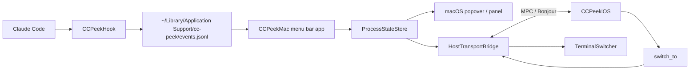

# CC Peek

CC Peek 把本机多个 Claude Code 进程的状态实时同步到一台 iPhone，并允许从手机一键切回到对应的终端窗口。它把 "需要审批 / 等待输入 / 已完成" 这类信号从主屏幕里搬到旁边的常驻第二屏，减少主屏的注意力切换。

项目面向使用第三方 API / API 代理运行 Claude Code 的场景，不依赖 claude.ai 官方 Remote Control，不做远程跨网访问。Mac 与 iPhone 通过 Apple MultipeerConnectivity 在同一近场网络通信。

## 当前状态

- **v1.0 已发布（2026-05-07）**
  - macOS：`CC Peek.app` 通过 [`ccpeek.com/download`](https://ccpeek.com/download) 分发，Developer ID 签名 + 公证 + Sparkle 自动更新。
  - iOS：`CC Peek` 已上架 App Store，Bundle ID `com.ccpeek.ios`。
- **后续迭代**：见 [`PRD.md`](./PRD.md) 与 [`PROGRESS.md`](./PROGRESS.md)。
- **v1.0 历史档案**：[`docs/PRD-v1.0.md`](./docs/PRD-v1.0.md) + [`docs/PROGRESS-v1.0.md`](./docs/PROGRESS-v1.0.md)。

主链路（已在真机验证）：

1. Claude Code 触发 hook 事件。
2. `CCPeekHook` 写入本地 `events.jsonl`。
3. macOS 菜单栏 app 消费事件，更新进程状态机。
4. macOS host 通过 MultipeerConnectivity 把状态推送到 iPhone。
5. iPhone 点击进程卡片，Mac 端切回对应终端窗口。

## 功能概览

- 采集 Claude Code 的 `SessionStart`、`UserPromptSubmit`、`PreToolUse`、`Notification`、`Stop`、`SessionEnd` 6 类 hook 事件。
- 识别进程状态：`active` / `waiting_input` / `waiting_permission` / `completed` / `unknown`。
- macOS 菜单栏图标显示进程总数与连接状态，Hook 异常时显示红点。
- macOS Dashboard popover / 全局快捷键 / 独立 Panel（菜单栏图标被遮挡时兜底）。
- iPhone 端：实时进程卡片、横竖屏自适应、屏幕常亮、stale 5 分钟分层、下拉刷新。
- iPhone 与 Mac 1:1 配对 + 白名单（基于 displayName，Keychain 持久化）。
- 终端切换：Terminal.app / iTerm2 按 tty 切到具体 tab；Ghostty / Warp / VS Code 等降级为激活应用。
- 演示模式：iOS 端不依赖 Mac 也可体验完整 UI（4 个进程、状态切换、卡片增删动画）。
- Sparkle 自动更新（Mac 端）+ 反馈通道（设置页一键复制日志摘要 → `mailto:`）。
- Mock client：CLI 工具用于无真机时验证 MPC 协议。

## 架构



Hook 是原生 Swift 单文件二进制，避免依赖用户 shell / Node / Python 等环境。Mac 与 iPhone 通信走 MultipeerConnectivity，service type `cc-peek-v1`，强制 TLS。

## 工程结构

```text
.
├── Package.swift
├── Sources
│   ├── CCPeekCore          # 跨平台模型、hook envelope、MPC transport
│   ├── CCPeekHook          # Claude Code hook 二进制
│   ├── CCPeekMac           # macOS 菜单栏 app
│   └── CCPeekMockClient    # mock iPhone CLI
├── ios/CCPeekiOS           # iOS SwiftUI app（Xcode project）
├── Resources               # macOS app Info.plist 与 entitlements
├── scripts
│   ├── build-app.sh                     # 出 "build/CC Peek.app"
│   ├── build-dmg.sh                     # 出 build/CCPeek.dmg
│   ├── build-release.sh                 # Developer ID 签名 + 公证 + DMG 全流程
│   ├── generate-app-store-assets.mjs    # 截图/icon 复用生成
│   └── render-review-demo-video.swift   # App Store 审核演示视频生成
├── website                 # ccpeek.com 静态站点（着陆页 / 隐私 / appcast）
├── app-store-assets        # iOS 上架资产（icon / 截图 / metadata / 审核视频）
├── docs                    # v1.0 封版文档
├── PRD.md                  # 活文档（v1.1+）
└── PROGRESS.md             # 活文档（v1.1+）
```

## 安装（终端用户）

最简单的方式：

- **Mac**：从 [`ccpeek.com/download`](https://ccpeek.com/download) 下载 DMG，拖入 Applications，首次打开按引导装 hook。
- **iPhone**：在 App Store 搜索 "CC Peek" 安装。

如果想自己从源码构建，看下面"开发"段。

## 开发

### 环境

- macOS 14+。
- Swift 5.9+。
- Xcode（运行 iOS app）。
- Claude Code 已安装，且允许写 `~/.claude/settings.json`。
- iPhone 与 Mac 同一近场网络，已授权"本地网络"权限。

### 构建 macOS App

```bash
./scripts/build-app.sh
```

输出 `build/CC Peek.app`，使用 adhoc 签名，可直接 `open`。

安装到 `/Applications`：

```bash
rm -rf "/Applications/CC Peek.app"
ditto "build/CC Peek.app" "/Applications/CC Peek.app"
open "/Applications/CC Peek.app"
```

构建可分享 DMG（仍是 adhoc 签名，仅自用）：

```bash
./scripts/build-dmg.sh
```

构建正式发布包（Developer ID 签名 + 公证 + DMG 公证）：

```bash
SIGN_IDENTITY="Developer ID Application: <your name> (<TEAMID>)" \
NOTARY_PROFILE="ccpeek-notary" \
APP_NOTARY_ID="<apple id>" \
./scripts/build-release.sh
```

`NOTARY_PROFILE` 指向 `xcrun notarytool store-credentials` 保存的 keychain profile。

### 安装 / 卸载 Hook

首次打开 Mac app 会进引导流程。命令行也可：

```bash
"/Applications/CC Peek.app/Contents/MacOS/CCPeekMac" --install-hook
"/Applications/CC Peek.app/Contents/MacOS/CCPeekMac" --uninstall-hook
"/Applications/CC Peek.app/Contents/MacOS/CCPeekMac" --print-hook-path
```

`--install-hook` 会修改 `~/.claude/settings.json`，写入前自动备份为 `settings.json.ccpeek-backup-<ts>`。

### 运行 iOS App

```bash
open ios/CCPeekiOS/CCPeekiOS.xcodeproj
```

在 Xcode 选开发团队 + 真机，跑 `CCPeekiOS` target。Mac 端 `CC Peek.app` 同时运行后，iPhone 端会自动发现 Mac，点击 → Mac 弹信任确认 → 配对完成。

未配对状态下也可以走"演示模式"体验完整 UI。

### Mock Client

无真机时验证 MPC：

```bash
swift run CCPeekMockClient
# 命令: snapshot | switch <process_id> | quit

# 多设备区分
CCPEEK_MOCK_NAME=DemoPhone swift run CCPeekMockClient
```

### 调试

```bash
# 重新触发首次引导（清 onboarding flag）
defaults delete com.ccpeek.mac ccpeek.onboardingCompleted
open "/Applications/CC Peek.app"

# 查看某个 PID 的父进程链与 tty 解析
"/Applications/CC Peek.app/Contents/MacOS/CCPeekMac" --debug-tree <pid>

# 开启 hook debug 日志（在跑 Claude Code 的 shell 内）
export CC_PEEK_DEBUG=1
```

主要数据路径：

```text
~/Library/Application Support/cc-peek/events.jsonl
~/Library/Application Support/cc-peek/hook.debug.log
~/.claude/settings.json
~/Library/LaunchAgents/com.ccpeek.mac.agent.plist
```

## 已知限制

- **配对当前为 1:1**：一台 Mac 同时只接受一台 iPhone；多 Mac / 多 iPhone 在 v1.1+ 路线（见 `PRD.md` §1.5、§5）。
- **iTerm2 真机覆盖未完成**：Terminal.app 已多窗口/多 tab 验证；iTerm2 AppleScript 路径写好但开发机器未装。
- **部分终端只能激活 app**：Ghostty / Warp / VS Code / WezTerm / Alacritty / Kitty 等无法精确切到具体 tab。
- **首次切终端会弹自动化权限**：macOS 系统级 TCC 弹窗，授权一次后续不再出现。
- **本地网络权限是硬依赖**：iPhone 拒绝则无法发现 Mac；Mac 端拒绝同理。
- **MCSession 状态偶发污染**：开发期反复连接断开后会出现新连接 1 秒即断现象，已加自动恢复（10s ≥3 次断开自动 `rebuildSession`），仍异常时手动重启 Mac app 兜底。
- **macOS 26 `kp_eproc.e_tdev` 字段失效**：tty 解析已 fallback 到 `/bin/ps -o tty=` 兜底，性能稍差但功能正常。

## 文档索引

- [`PRD.md`](./PRD.md)：活文档，v1.1+ 产品定义。
- [`PROGRESS.md`](./PROGRESS.md)：活文档，v1.1+ 开发进度。
- [`docs/PRD-v1.0.md`](./docs/PRD-v1.0.md)：v1.0 封版 PRD（已交付的产品形态）。
- [`docs/PROGRESS-v1.0.md`](./docs/PROGRESS-v1.0.md)：v1.0 封版开发记录。
- [`AGENTS.md`](./AGENTS.md)：与 Codex / Claude 类协作 agent 协同的工作流约定。
