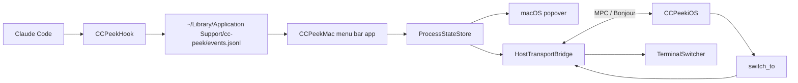

# CC Peek

CC Peek 是一个给 Claude Code 使用者准备的「桌面第二屏」工具。它把本机多个 Claude Code 进程的状态同步到 iPhone，并允许从手机上一键切回对应的终端窗口。

这个项目面向使用第三方 API / API 代理运行 Claude Code 的场景。它不依赖 claude.ai 官方 Remote Control，也不做远程跨网访问；核心使用方式是在电脑旁边放一台 iPhone，把进程状态从主屏幕里移出来。

## 当前状态

项目已经实现 macOS 菜单栏 host、Claude Code hook、本地事件消费、终端窗口切换、MultipeerConnectivity 近场通信、iOS 端配对与 Dashboard UI。

已验证的主链路：

1. Claude Code 触发 hook 事件。
2. `CCPeekHook` 写入本地 `events.jsonl`。
3. macOS 菜单栏 app 消费事件并更新进程状态。
4. macOS host 通过 MPC 将状态推送到 iPhone。
5. iPhone 点击进程卡片后，macOS 端切换到对应终端窗口。

更细的进度记录见 [PROGRESS.md](./PROGRESS.md)，产品需求见 [cc-peek-PRD-v0.4.md](./cc-peek-PRD-v0.4.md)。

## 功能概览

- 采集 Claude Code 的 `SessionStart`、`UserPromptSubmit`、`PreToolUse`、`Notification`、`Stop`、`SessionEnd` 等 hook 事件。
- 识别进程状态：`active`、`waiting_input`、`waiting_permission`、`completed`、`unknown`。
- macOS 菜单栏显示进程状态与徽章数量。
- iPhone 端显示实时进程卡片、离线 stale 状态、下拉刷新、配对设置与常亮控制。
- 支持 iPhone 到 Mac 的 1:1 配对与白名单。
- 支持从 iPhone 发起 `switch_to`，Mac 端切到 Terminal.app / iTerm2 对应 tab；其他终端按能力降级为激活应用。
- 提供 mock iPhone CLI，用于无真机时验证 MPC 协议。

## 架构



Hook 采用原生 Swift 二进制，避免依赖用户 shell、Node、Python 等环境。Mac 与 iPhone 间通信使用 Apple 的 MultipeerConnectivity，service type 为 `cc-peek-v1`。

## 工程结构

```text
.
├── Package.swift
├── Sources
│   ├── CCPeekCore          # 跨平台模型、hook envelope、MPC transport
│   ├── CCPeekHook          # Claude Code hook 二进制
│   ├── CCPeekMac           # macOS 菜单栏 app
│   └── CCPeekMockClient    # mock iPhone CLI
├── ios/CCPeekiOS           # iOS SwiftUI app / Xcode project
├── Resources               # macOS app Info.plist 与 entitlements
├── scripts/build-app.sh    # 打包 build/CCPeek.app
├── cc-peek-PRD-v0.4.md     # 当前 PRD
└── PROGRESS.md             # 开发进度与已知限制
```

## 环境要求

- macOS 14+。
- Swift 5.9+。
- Xcode，用于构建和真机运行 iOS app。
- Claude Code，并允许写入 `~/.claude/settings.json`。
- iPhone 与 Mac 在同一近场网络环境下，并允许本地网络权限。

## 构建 macOS App

```bash
./scripts/build-app.sh
```

脚本会执行 release 构建，生成：

```text
build/CCPeek.app
```

直接运行：

```bash
open build/CCPeek.app
```

安装到 `/Applications`：

```bash
rm -rf /Applications/CCPeek.app
ditto build/CCPeek.app /Applications/CCPeek.app
open /Applications/CCPeek.app
```

生成可分享的拖拽安装 DMG：

```bash
./scripts/build-dmg.sh
```

脚本会生成：

```text
build/CCPeek.dmg
```

打开 DMG 后，窗口左侧是 `CCPeek.app`，右侧是 `Applications` 文件夹。用户把 app 拖到 `Applications` 即可完成安装。背景图里也包含 Gatekeeper 提示：如果打开时报“无法验证开发者”，到“系统设置 > 隐私与安全性”往下滑找到 CC Peek，然后点击“仍要打开”。

开发期脚本使用 adhoc 签名。正式分发前需要替换为 Developer ID 签名与完整发布流程。

## 安装 Claude Code Hook

首次打开 macOS app 会进入引导流程，也可以直接用命令安装 hook：

```bash
"/Applications/CCPeek.app/Contents/MacOS/CCPeekMac" --install-hook
```

安装行为：

- 修改 `~/.claude/settings.json`。
- 为 6 类 Claude Code hook 事件追加 CC Peek 命令。
- 写入前会备份已有 `settings.json`。
- hook 命令指向 app bundle 内的 `CCPeekHook`。

卸载 hook：

```bash
"/Applications/CCPeek.app/Contents/MacOS/CCPeekMac" --uninstall-hook
```

查看 hook 二进制路径：

```bash
"/Applications/CCPeek.app/Contents/MacOS/CCPeekMac" --print-hook-path
```

## 运行 iOS App

1. 打开 Xcode project：

   ```bash
   open ios/CCPeekiOS/CCPeekiOS.xcodeproj
   ```

2. 在 Xcode 中选择开发团队与真机。
3. 运行 `CCPeekiOS` target。
4. 确保 Mac 端 `CCPeek.app` 正在运行。
5. iPhone 端发现 Mac 后点击配对。
6. Mac 端弹出信任确认后选择信任。

配对完成后，iPhone 会自动请求 snapshot，并持续接收状态变化。解除配对会通过 `unpair_notification` 尽力同步到 Mac 端。

## Mock Client

没有 iPhone 真机时，可以用 mock client 验证 Mac host 的 MPC 链路：

```bash
swift run CCPeekMockClient
```

启动后支持命令：

```text
snapshot
switch <process_id>
quit
```

如果要区分多个 mock 设备，可以设置显示名：

```bash
CCPEEK_MOCK_NAME=DemoPhone swift run CCPeekMockClient
```

## 常用调试命令

重新触发首次引导：

```bash
defaults delete com.ccpeek.mac ccpeek.onboardingCompleted
open /Applications/CCPeek.app
```

调试某个 PID 的父进程链和 tty：

```bash
"/Applications/CCPeek.app/Contents/MacOS/CCPeekMac" --debug-tree <pid>
```

开启 hook debug 日志：在启动 Claude Code 前，让它继承这个环境变量。

```bash
export CC_PEEK_DEBUG=1
```

主要运行数据路径：

```text
~/Library/Application Support/cc-peek/events.jsonl
~/Library/Application Support/cc-peek/hook.debug.log
```

## 已知限制

- 当前 MVP 是 Mac 与 iPhone 1:1 配对；多 Mac / 多 iPhone 是后续方向。
- iTerm2 路径仍需要更多真机覆盖；Terminal.app 已做过多窗口、多 tab 验证。
- Warp、Ghostty、VS Code 等终端目前按能力降级，通常只能激活 app，不能精确切 tab。
- 首次使用终端切换能力时，macOS 可能弹出 AppleScript 自动化权限。
- MPC 依赖本地网络 / Bonjour 权限；如果 iPhone 无法发现 Mac，优先检查本地网络权限与同网环境。
- 开发期 adhoc 签名与登录项能力存在兼容限制，当前使用 LaunchAgent backend 兜底。

## 文档索引

- [PROGRESS.md](./PROGRESS.md)：开发进度、当前部署状态、常用命令、遗留项。
- [cc-peek-PRD-v0.4.md](./cc-peek-PRD-v0.4.md)：产品定位、需求、协议与边界。
- [cc-peek-Mac-UI-design-lite.md](./cc-peek-Mac-UI-design-lite.md)：macOS UI 设计稿说明。
- [cc-peek-iOS-UI-design-lite.md](./cc-peek-iOS-UI-design-lite.md)：iOS UI 设计稿说明。
- [cc-peek-website-UI-design-lite.md](./cc-peek-website-UI-design-lite.md)：网站设计稿说明。
