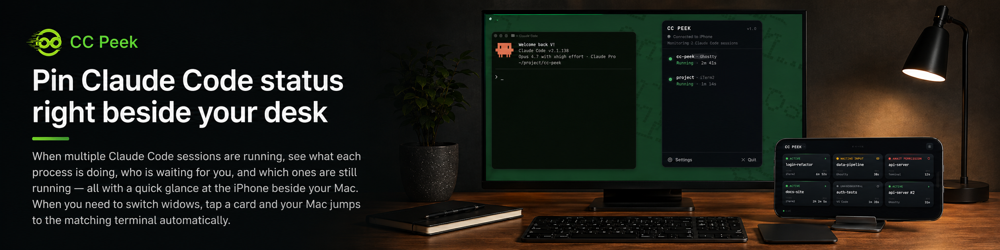
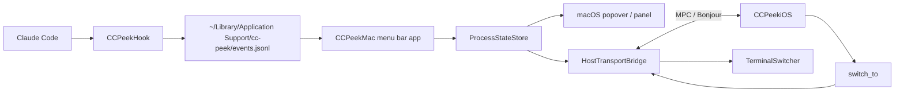

# CC Peek



English | [简体中文](./README.zh-CN.md)

CC Peek syncs the status of multiple local [Claude Code](https://claude.com/claude-code) sessions to an iPhone in real time, and lets you jump back to the matching terminal window with one tap.

It moves signals like "needs approval", "waiting for input", and "finished" onto a persistent side screen, so your main display can stay focused on coding.

- **Website**: [ccpeek.com](https://ccpeek.com)

## What problem does it solve?

When you run several Claude Code sessions at the same time, questions like "which one is waiting for my approval?" or "which one just finished?" get buried in terminal tabs, the menu bar, and notifications. You end up switching windows just to check status.

CC Peek aggregates those states and pushes them to an iPhone as a persistent side screen:

- See all Claude Code sessions at a glance (`ACTIVE` / `WAITING INPUT` / `AWAIT PERMISSION` / `UNKNOWN`).
- Tap a session card on iPhone to bring the matching terminal window to the front on your Mac.
- No cloud service or account required. Mac and iPhone communicate nearby through Apple MultipeerConnectivity.

## Installation

| Platform | Channel |
|---|---|
| macOS | [ccpeek.com/download](https://ccpeek.com/download) or [GitHub Releases](https://github.com/FalkoWing/CC-Peek/releases) |
| iOS | [App Store](https://apps.apple.com/app/cc-peek/id6766753337) |

On first launch, the Mac app guides you through installing the Claude Code hook. It writes to `~/.claude/settings.json` and automatically creates a backup before changing an existing file. The iOS app discovers nearby Macs; tap trust to pair.

## Requirements

- macOS 14+
- iOS 17+
- Mac and iPhone must be discoverable nearby; being on the same local network is the most stable setup, while the actual link is chosen by Apple MultipeerConnectivity at the system level
- Local Network permission granted on both iPhone and Mac
- Claude Code installed, with permission to write `~/.claude/settings.json`

## Features

- **Session state aggregation**: listens to 6 Claude Code hook events: `SessionStart`, `UserPromptSubmit`, `PreToolUse`, `Notification`, `Stop`, and `SessionEnd`, then maps them into 4 visible states.
- **One-tap terminal switching**: Terminal.app and iTerm2 can switch precisely to the matching tab by tty; Ghostty, Warp, VS Code, WezTerm, Alacritty, Kitty, and others fall back to activating the app.
- **Menu bar, dashboard, and global shortcut**: the menu bar icon shows session count and connection status, with a red dot when hook health checks fail; the dashboard popover and global shortcut provide multiple entry points.
- **1:1 pairing and allowlist**: a local allowlist based on display name and pairing token helps prevent accidental connections.
- **iPhone experience**: landscape and portrait layouts, keep-screen-awake support, 5-minute stale state tiering, and pull-to-refresh.
- **Sparkle updates** for the Mac app.

## Architecture



- The hook is a native single-file Swift binary and does not depend on the user's shell, Node, Python, or other runtime environments.
- Mac and iPhone communicate through MultipeerConnectivity, using service type `cc-peek-v1` and encrypted transport (`MCEncryptionPreference.required`).
- CC Peek does not provide remote cross-network access.

## Privacy and permissions

- **Local nearby communication**: Mac and iPhone discover and communicate with each other through Apple MultipeerConnectivity nearby. No account is required, and traffic is not relayed through a CC Peek cloud service.
- **Claude Code Hook**: the Mac app writes command hooks for `SessionStart`, `UserPromptSubmit`, `PreToolUse`, `Notification`, `Stop`, and `SessionEnd` to `~/.claude/settings.json`. The entries point to `CCPeekHook` and include a `_ccpeek_marker` marker so they can be identified and removed later.
- **Automatic backup**: if `~/.claude/settings.json` already exists, CC Peek creates a backup next to it named `settings.json.ccpeek-backup-<timestamp>` before writing.
- **Uninstall and cleanup**: use "Settings -> Danger zone -> Clear configuration data" in the Mac app to remove the hook, paired iPhones, launch-at-login setting, global shortcut, onboarding/preferences, and app data under `~/Library/Application Support/cc-peek/`. You can also run `--uninstall-hook` from the command-line entry points below to remove only the hook.

## Build from source

Prerequisites:

- Xcode 15.3+ with the Swift 5.10 toolchain
- macOS 14+
- A physical iOS device and an Apple Developer Team, only if you want to build or debug the iOS app

### macOS app

```bash
git clone https://github.com/FalkoWing/CC-Peek.git
cd CC-Peek
./scripts/build-app.sh
```

This produces `build/CC Peek.app` with an ad-hoc signature. You can open it directly or copy it to `/Applications`:

```bash
ditto "build/CC Peek.app" "/Applications/CC Peek.app"
open "/Applications/CC Peek.app"
```

To build a shareable DMG, also ad-hoc signed:

```bash
./scripts/build-dmg.sh
```

### Code signing

The DMG from `ccpeek.com/download` is Developer ID signed and Apple-notarized, so it can be opened by double-clicking.

The app produced by `./scripts/build-app.sh` is ad-hoc signed. On first launch, macOS Gatekeeper may block it as coming from an unidentified developer. Use one of these options:

- In Finder, right-click `CC Peek.app`, choose Open, then click Open again in the dialog. This is only needed once.
- Or remove the quarantine attribute from the command line:

```bash
xattr -dr com.apple.quarantine "build/CC Peek.app"
```

### iOS app

Open `ios/CCPeekiOS/CCPeekiOS.xcodeproj` in Xcode, select your Apple Developer Team in the target settings, connect a physical device, and run the `CCPeekiOS` target. With the Mac app running at the same time, both sides should discover each other; tap on iPhone, confirm trust on Mac, and pairing is complete.

### Command-line entry points

```bash
"/Applications/CC Peek.app/Contents/MacOS/CCPeekMac" --install-hook
"/Applications/CC Peek.app/Contents/MacOS/CCPeekMac" --uninstall-hook
"/Applications/CC Peek.app/Contents/MacOS/CCPeekMac" --print-hook-path

# Inspect the parent process chain and tty for a PID
"/Applications/CC Peek.app/Contents/MacOS/CCPeekMac" --debug-tree <pid>
```

### Mock client

Use this to validate the MPC protocol without a physical iPhone:

```bash
swift run CCPeekMockClient
# Commands: snapshot | switch <process_id> | quit

# Distinguish multiple mock devices
CCPEEK_MOCK_NAME=DemoPhone swift run CCPeekMockClient
```

## Project layout

```text
.
├── Package.swift
├── Sources
│   ├── CCPeekCore          # Cross-platform models / hook envelope / MPC transport
│   ├── CCPeekHook          # Claude Code hook binary
│   ├── CCPeekMac           # macOS menu bar app
│   └── CCPeekMockClient    # Mock iPhone CLI
├── ios/CCPeekiOS           # iOS SwiftUI app (Xcode project)
├── Resources               # macOS app Info.plist and entitlements
├── scripts                 # build-app.sh / build-dmg.sh
└── docs/glossary.md        # Cross-platform terminology glossary
```

## Known limitations

- **Pairing is currently 1:1**: one Mac accepts only one iPhone at a time.
- **Some terminals can only be activated at app level**: Ghostty, Warp, VS Code, WezTerm, Alacritty, Kitty, and others cannot be switched to a specific tab.
- **The first terminal switch may trigger Automation permission**: this is a macOS TCC prompt. Grant it once and it should not appear again.
- **Local Network permission is required**: if either iPhone or Mac denies it, the devices cannot discover each other.

## License

Apache License 2.0. See [LICENSE](./LICENSE) and [NOTICE](./NOTICE).

## Third-party open source components

- [KeyboardShortcuts](https://github.com/sindresorhus/KeyboardShortcuts): global shortcut recording and management (MIT License).
- [Sparkle](https://sparkle-project.org/): macOS update framework (MIT License).

## Links

- Website: [ccpeek.com](https://ccpeek.com)
- App Store: [apps.apple.com/app/cc-peek/id6766753337](https://apps.apple.com/app/cc-peek/id6766753337)
- Issues: [github.com/FalkoWing/CC-Peek/issues](https://github.com/FalkoWing/CC-Peek/issues)
- Releases: [github.com/FalkoWing/CC-Peek/releases](https://github.com/FalkoWing/CC-Peek/releases)
