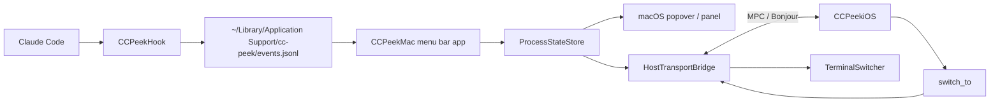

# CC Peek

把本机多个 [Claude Code](https://claude.com/claude-code) 进程的状态实时同步到一台 iPhone，并允许从手机一键切回对应的终端窗口。

把"需要审批 / 等待输入 / 已完成"这类信号从主屏搬到旁边的常驻第二屏，主屏可以专心写代码。

- **官网**：[ccpeek.com](https://ccpeek.com)

## 这个工具解决什么问题

同时跑多个 Claude Code 进程时，"哪个在等我审批？哪个跑完了？"这类信号会被埋在终端 tab、菜单栏、通知中心里，需要不停切窗口去看。

CC Peek 把这些状态聚合后实时推送到一台 iPhone 当作常驻第二屏：

- iPhone 上一眼看到所有进程的状态（`ACTIVE` / `WAITING INPUT` / `AWAIT PERMISSION` / `UNKNOWN`）。
- 点一下进程卡片，Mac 端把对应终端窗口切到前台。
- 不依赖任何云服务 / 账号，Mac 与 iPhone 走 Apple MultipeerConnectivity 在同一近场网络通信。

## 安装

| 平台 | 渠道 |
|---|---|
| macOS | [ccpeek.com/download](https://ccpeek.com/download) 或 [GitHub Releases](https://github.com/FalkoWing/CC-Peek/releases) |
| iOS | App Store 搜索 "CC Peek" |

首次打开 Mac app 会引导你装 Claude Code 的 hook（写入 `~/.claude/settings.json`，写入前自动备份）。iOS app 在同网段会自动发现 Mac，点击信任即配对完成。

未配对状态下也可以走"演示模式"完整体验 iOS UI（4 个进程、状态切换、卡片动画）。

## 系统要求

- macOS 14+
- iOS 17+
- Mac 与 iPhone 在同一近场网络（Wi-Fi / 蓝牙）
- iPhone 与 Mac 都授予了"本地网络"权限
- Claude Code 已安装，且允许写 `~/.claude/settings.json`

## 主要功能

- **进程状态聚合**：监听 Claude Code 的 `SessionStart` / `UserPromptSubmit` / `PreToolUse` / `Notification` / `Stop` / `SessionEnd` 6 类 hook 事件，识别出 4 种状态。
- **一键切回终端**：Terminal.app / iTerm2 按 tty 精确切到具体 tab；Ghostty / Warp / VS Code / WezTerm / Alacritty / Kitty 等降级为激活对应应用。
- **菜单栏 + Dashboard + 全局快捷键**：菜单栏图标显示进程总数与连接状态，Hook 异常时显示红点；Dashboard popover 与全局快捷键提供多种打开方式。
- **1:1 配对 + 白名单**：基于 displayName + 配对 token 的白名单，本地持久化，避免误连。
- **iPhone 端体验**：横竖屏自适应、屏幕常亮、5 分钟 stale 分层、下拉刷新。
- **Sparkle 自动更新**（Mac 端）。

## 架构



- Hook 是原生 Swift 单文件二进制，不依赖用户 shell / Node / Python 等环境。
- Mac ↔ iPhone 通信走 MultipeerConnectivity，service type `cc-peek-v1`，强制 TLS。
- 不做远程跨网访问。

## 从源码构建

### macOS app

```bash
git clone https://github.com/FalkoWing/CC-Peek.git
cd CC-Peek
./scripts/build-app.sh
```

输出 `build/CC Peek.app`，使用 ad-hoc 签名，可直接 `open` 或 `ditto` 到 `/Applications`：

```bash
ditto "build/CC Peek.app" "/Applications/CC Peek.app"
open "/Applications/CC Peek.app"
```

构建可分享 DMG（仍是 ad-hoc 签名）：

```bash
./scripts/build-dmg.sh
```

### 关于签名

官网 `ccpeek.com/download` 的 DMG 是 Developer ID 签名 + Apple 公证，双击即可打开。

`./scripts/build-app.sh` 输出的是 ad-hoc 签名包，第一次打开会被 macOS Gatekeeper 拦截（"来自身份不明的开发者"），二选一即可：

- 在 Finder 里右键 `CC Peek.app` → 打开 → 弹窗里再点"打开"（只需一次）
- 或命令行去除隔离属性：

```bash
xattr -dr com.apple.quarantine "build/CC Peek.app"
```

### iOS app

用 Xcode 打开 `ios/CCPeekiOS/CCPeekiOS.xcodeproj`，在 target 设置里选自己的 Apple Developer Team，连真机跑 `CCPeekiOS` target 即可。Mac 端 `CC Peek.app` 同时运行后两端会自动发现彼此，点击 → Mac 弹信任确认 → 配对完成。

### 命令行入口

```bash
"/Applications/CC Peek.app/Contents/MacOS/CCPeekMac" --install-hook
"/Applications/CC Peek.app/Contents/MacOS/CCPeekMac" --uninstall-hook
"/Applications/CC Peek.app/Contents/MacOS/CCPeekMac" --print-hook-path

# 解析某个 PID 的父进程链与 tty
"/Applications/CC Peek.app/Contents/MacOS/CCPeekMac" --debug-tree <pid>
```

### Mock client（无真机时验证 MPC 协议）

```bash
swift run CCPeekMockClient
# 命令: snapshot | switch <process_id> | quit

# 多设备区分
CCPEEK_MOCK_NAME=DemoPhone swift run CCPeekMockClient
```

## 工程结构

```text
.
├── Package.swift
├── Sources
│   ├── CCPeekCore          # 跨平台模型 / hook envelope / MPC transport
│   ├── CCPeekHook          # Claude Code hook 二进制
│   ├── CCPeekMac           # macOS 菜单栏 app
│   └── CCPeekMockClient    # Mock iPhone CLI
├── ios/CCPeekiOS           # iOS SwiftUI app（Xcode 工程）
├── Resources               # macOS app Info.plist 与 entitlements
├── scripts                 # build-app.sh / build-dmg.sh
└── docs/glossary.md        # 跨端术语对照
```

## 已知限制

- **配对当前为 1:1**：一台 Mac 同时只接受一台 iPhone。
- **部分终端只能激活 app**：Ghostty / Warp / VS Code / WezTerm / Alacritty / Kitty 等无法精确切到具体 tab。
- **首次切终端会弹自动化权限**：macOS 系统级 TCC 弹窗，授权一次后续不再出现。
- **本地网络权限是硬依赖**：iPhone / Mac 任一端拒绝则无法发现对端。

## 协议

Apache License 2.0。详见 [LICENSE](./LICENSE) 与 [NOTICE](./NOTICE)。

## 链接

- 官网：[ccpeek.com](https://ccpeek.com)
- Issues：[github.com/FalkoWing/CC-Peek/issues](https://github.com/FalkoWing/CC-Peek/issues)
- Releases：[github.com/FalkoWing/CC-Peek/releases](https://github.com/FalkoWing/CC-Peek/releases)
